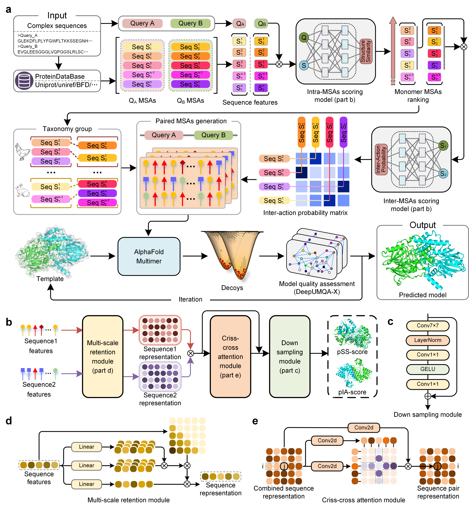

# DeepSCFold

DeepSCFold is designed for high-accuracy protein complex structure modeling using complex paired MSAs constructed by identifying potential interaction relationships between monomeric sequences. In the paired-MSA construction, the key component of DeepSCFold is two sequence-based deep learning models that predicts protein-protein structural similarity (pSS-score) and interaction probability (pIA-score). For the input protein complex sequences, DeepSCFold first generates monomeric multiple sequence alignments (MSAs) from multiple sequence databases (such as UniRef30, UniRef90, UniProt, BFD, MGnify, and the ColabFold DB). Then, the predicted pSS-score between the input sequence and each sequence alignment in the monomer MSAs was used for ranking and selecting the monomer MSAs. Subsequently, the developed deep learning model predicts the pIA-scores for the sequence alignments from different subunit MSAs to construct paired MSAs. Additionally, we use information from multiple sources, such as species annotations, UniProt accession number, and protein complexes from the Protein Data Bank (PDB), to further construct extra paired MSAs. Subsequently, DeepSCFold uses the series of paired MSAs constructed above to perform complex structure predictions through AlphaFold-Multimer. The top-1 model is selected based on our in-house complex model quality assessment method.

## **Overall workflow for the DeepSCFold Protein tertiary structure prediction system**

